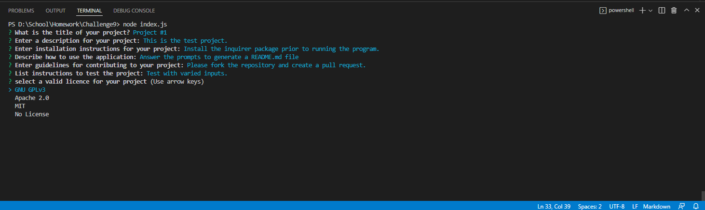
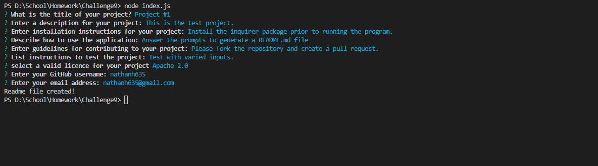
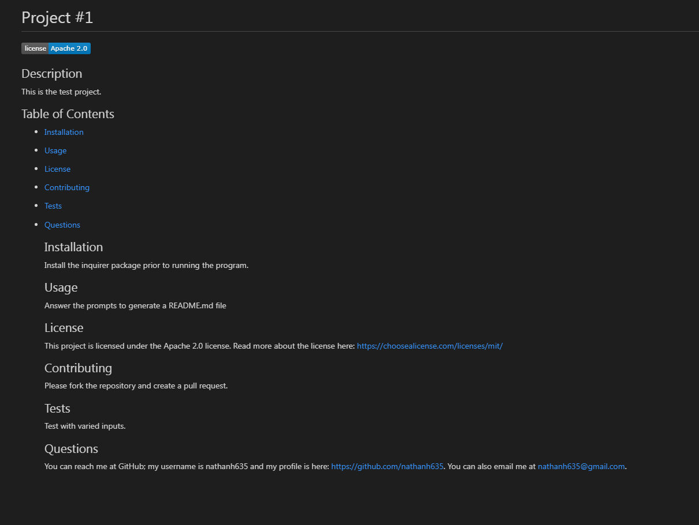

# README Generator
  

  ## Description

  The project is designed to generate a professional quality README.md file, based on user inputs. A series of prompts will get info from the user and will be relayed into a readme template.

## Table of Contents

- [Installation](#installation)
- [Usage](#usage)
- [License](#License)
- [Contributing](#contributing)
- [Tests](#tests)
- [Questions](#questions)
- [Screenshots](#screenshots)
- [Links](#links)

  ## Installation

  To run the project, the inquirer module must be installed using "npm i inquirer".

  ## Usage

  The program is run by typing "node index.js" in the command line while in the correct file directory.

  ## License

  This project is licensed under the MIT license.
  https://choosealicense.com/licenses/mit/
  

  ## Contributing

  Please fork the repository and submit a pull request for changes.

  ## Tests

  Test the project using a variety of inputs.

  ## Questions

  You can reach me at GitHub; my username is nathanh635 and my profile is here: https://github.com/nathanh635. You can also email me at nathanh635@gmail.com. 

  ## Screenshots

  Below are some screenshots of the application running and the generated README.md file. The example readme is also available under "./utils/exampleREADME.md".

  
## Links

  Repository: https://github.com/nathanh635/README-Generator